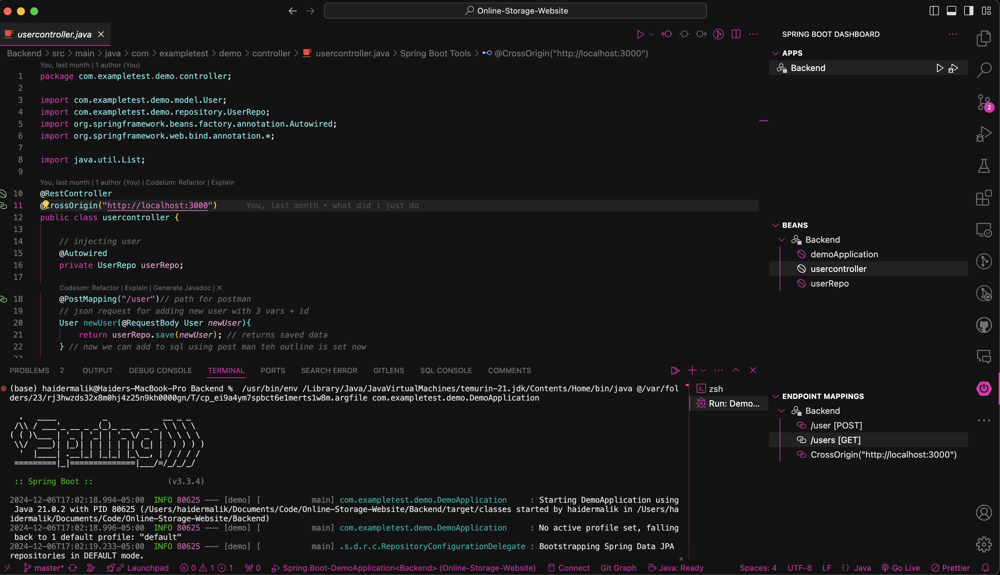
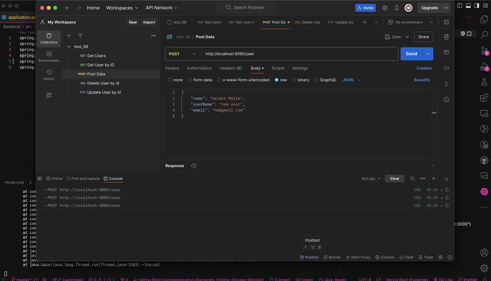
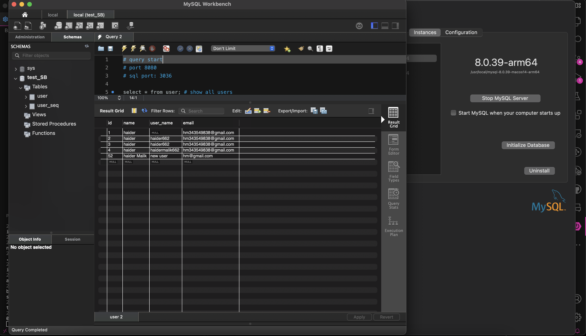

My Online Storage Website:
This website’s backend is in spring boot which provides it access to the database in my case MySQL, postman is used for API calls to store the data from a Java class to mySQL. The frontend is made using ReactJS + Bootstrap allowing for the addition of data by the user. Everything is hosted on a Raspberry Pi 4.

** Compnents **
- Backend:
I started with a spring boot application, which controls the user data: for example, when a user creates a new account they input a name, username and email, The user model class has a class defined with attributes for this name and username, so think of it as user input where the input is to the user class. this data is passed to our user controller which maps and handles the data to the database.

- Postman Rest API
I used Postman to send a rest API call to the spring boot application, this call gets or sends the user info input at the front end. The spring boot application then handles this call and maps it to the user model class, then this data is passed to the postman which then handles the data and maps it to the database.

- SQL Database
Postman sends its data to an SQL database where a SQL table with the proper columns is ready to store each user’s name and username. So in short this SQL database is connected to our Springboot app using Postman API

- Frontend
The front end is made using ReactJS + bootstrap, this is where the user inputs their name and username etc to create an account. once they have created their account they can input anything they want into the database including files, pictures, passwords etc.

- Server
Everything including the backend spring boot app, postman API, SQL database and the react JS frontend is all hosted on my Raspberry Pi 4. This server hosts all the applications and handles all the data inputted by the users.

** Why I created this **
this full-stack app taught me how all the components of a full-stack app connect, how the backend communicates with the frontend and how the data is stored etc. with this knowledge I have learned how each individual part, backend, frontend, database etc comes together to form a complete application that can be used in the real world. along with this, i had complete control over everything which while challenging was also very rewarding.

** Some Pictures of the App **
- Please note this app is still under process but the user account is complete and fully functional all I have to do now is add the rest of the features which mostly include being able to store things other than just text.

- Website

- SpringBoot

- Postman API

- SQL Database

- SQL Database Table

- Thank You